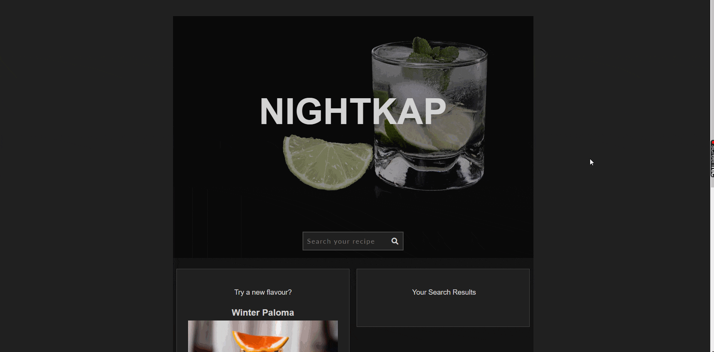
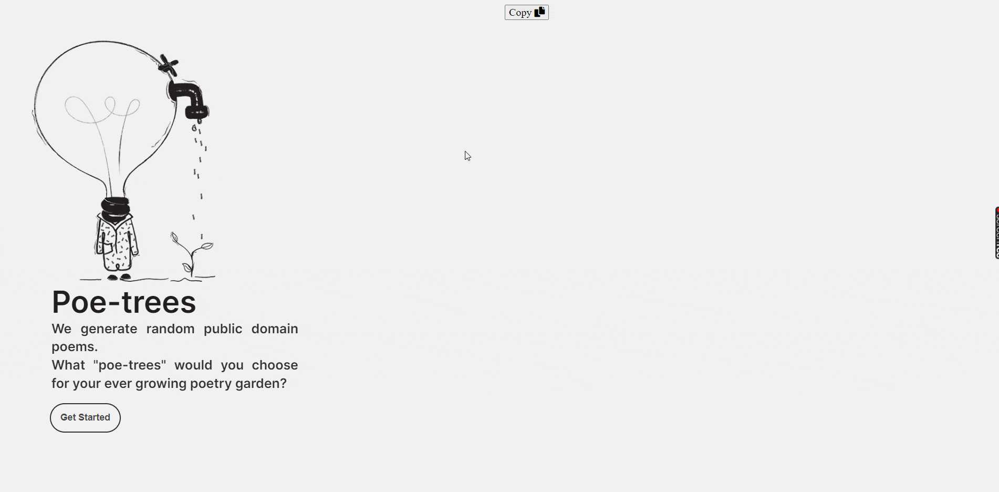
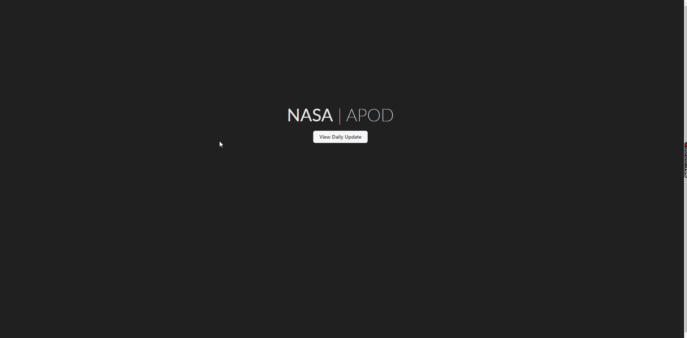

<h1 align="center">Hello, my name is Michelle</h1>  
<h3 align="center">I am a software developer with a strong background in clinical healthcare.</h3>  
   
  

 ☆ Looking forward to collaborate on open source projects 

 💬 Reach me out at **biokoder@pm.me**
  

 

<h3 align="left">Languages and Tools:</h3>  

 
 
 
 
 
 
  
 
 
  
 
<h3 align="left">Streak Stats:</h3>  

<h3 align="left">♡</h3>  

  
      
<!--Recent Projects-->
<table>
<tbody>
<tr>	
<!--1-->
<td width="50%">
				<h3 align="center" color="white">Vegan Dark-Kitchen</h2>
					
					 
					 
					

                        <!--Description and Links --> 
						  
                        <!--Deployed --> 
							
					

					
<strong>Turning plant-based ingredients into comfort food. Online food ordering integration.

</td>	
<!--2 -->
<td width="50%">
				<h3 align="center" color="white">Nightkap</h2>
					
					 
					 
					

                        <!--Description and Links --> 
						  
                        <!--Deployed --> 
							
					

					
Are you interested in different drinks? Discover hundreds of new cocktail recipes!
</td>
</tr>
<!--3-->
<tr>
<td width="50%">
				<h3 align="center" color="white">ISS Tracker</h2>
					
					 
					 
					

                        <!--Description and Links --> 
						  
                        <!--Deployed --> 
							
					

					
<strong>Real-time tracking of the International Space Station's location.
</td>
<!--4-->					
<td width="50%">
				<h3 align="center" color="white">Implaoss</h2>  
					  
				   
				   
				

                        <!--Description and Links --> 
						  
                        <!--Deployed --> 
							
					

					
<strong>Dental office and laboratory website with a smile gallery and patient testimonials on video. 

</td>
</tr>
<!--5-->		
<tr>
<td width="50%">
				<h3 align="center" color="white">Poe-tree</h2>
					
					 
					 
					

                        <!--Description and Links --> 
						  
                        <!--Deployed --> 
							
					

					
<strong>Poems, everybody! We still love them, don't we? Random public domain poems generator.  
</td>
<!--6-->		
<td width="50%">
				<h3 align="center" color="white">NASA APOD</h2>
					
					 
					 
					

                        <!--Description and Links --> 
						  
                        <!--Deployed --> 
							
					

					
Dark mode version of NASA Astronomy Picture of the Day. Explore the universe!
</td>
</tr>
</tbody>
</table>
<!-- End of Recent Projects -->

<h1 align="center"></h1>  

  
  

   

